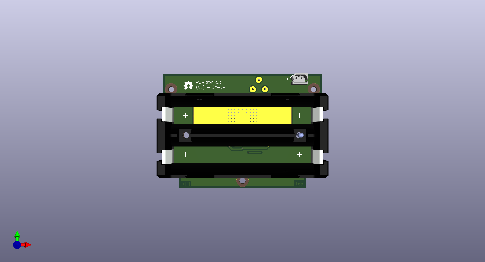
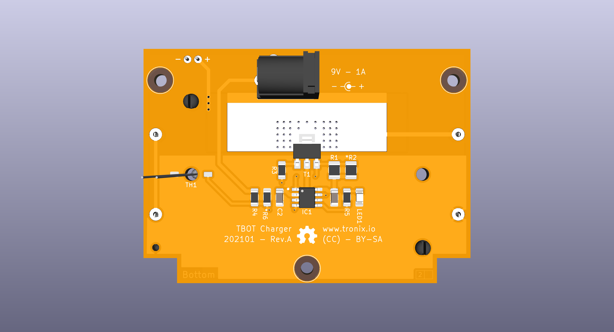

# DRAFT - TBOT 2 Wheels.

## Features.

- 2 Wheels.
-   Continuous Servos Motors.
- Power 2xCells 18650 Lithium Ion Rechargeable Batteries, with charger embedded.
- [PARALLAX Small Robot Chassis.](https://www.parallax.com/product/700-00022)
- [PARALLAX Small Robot Whell and Tire.](https://www.parallax.com/product/28114)
- [PARALLAX 1" Tail Whell Ball.](https://www.parallax.com/product/700-00009)
- [PARALLAX Feedback 360 High Speed Servo.](https://www.parallax.com/product/900-00360)

## Dashboards.

- [PCB Dashboard](https://github.com/tronixio/tbot/projects/1)
- [CODE Dashboard](https://github.com/tronixio/tbot/projects/2)

## Schematics.

- [Charger 2x18650](./0.Kicad/charger)
- [TODO - MCU Board](./0.Kicad/mcu)
- [TODO - IR Line Follow](./0.Kicad/ir-line)

## Charger top.

## Charger bottom.

---